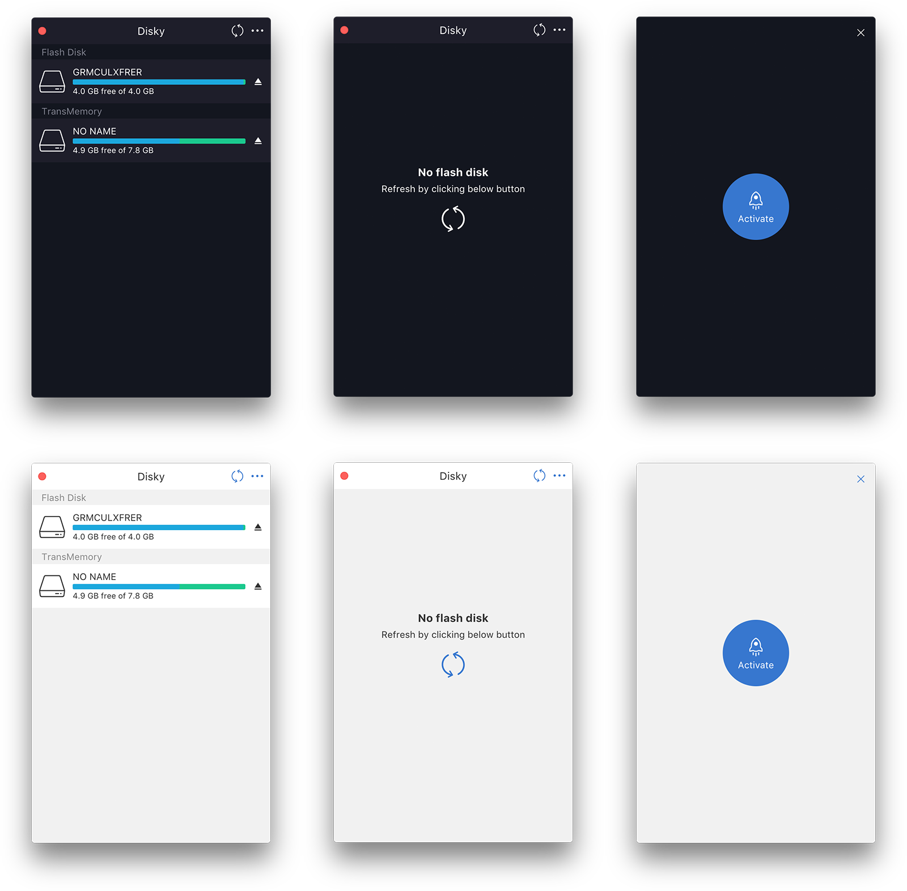

Disky
=====

> Make NTFS writable on macOS

---

## Screenshots



## Development

```bash
npm i dool -g
npm i

npm run dev
npm run start

# Electron Mirror of China
ELECTRON_MIRROR="https://npm.taobao.org/mirrors/electron/"

npm run pack
npm run disk
```

## Report a issue

* [All issues](https://github.com/d-band/disky/issues)
* [New issue](https://github.com/d-band/disky/issues/new)

## License

Disky is available under the terms of the MIT License.
